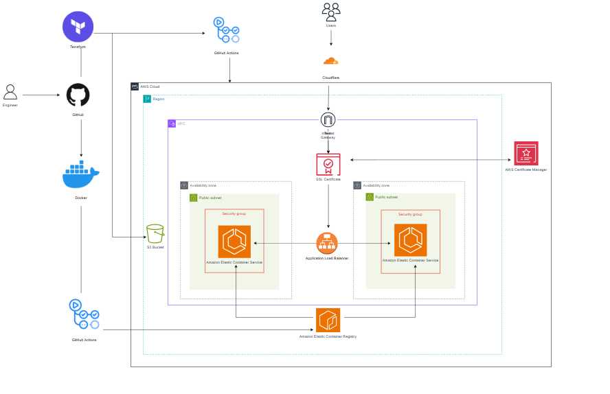
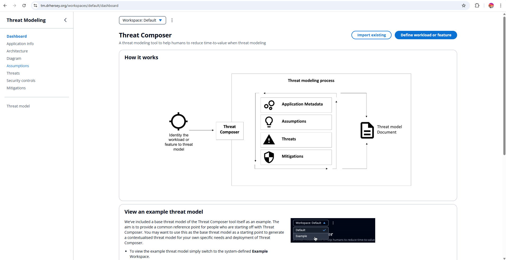
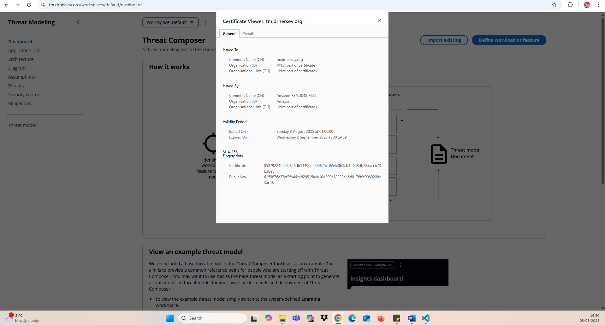
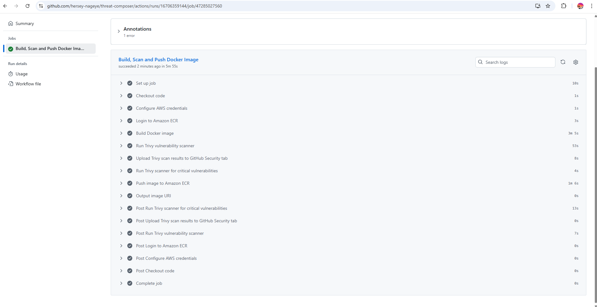
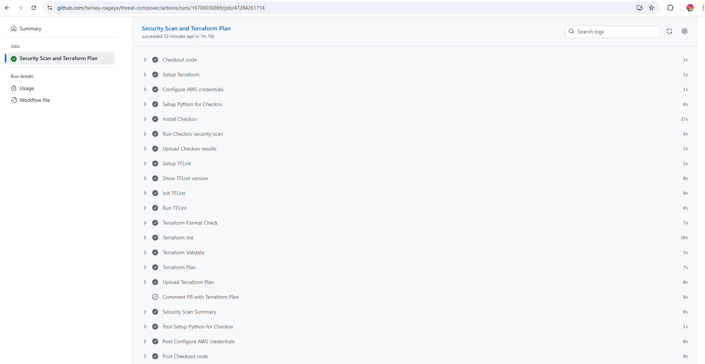
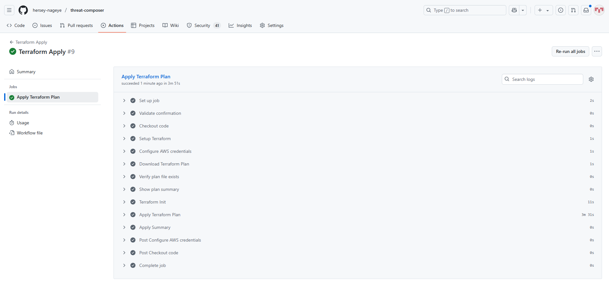
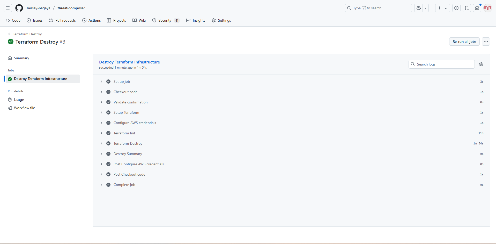

# Threat Composer ECS Deployment

## Overview

This project automates the deployment of Threat Composer—an open-source threat modelling tool developed by Amazon—to Amazon ECS using Docker, Terraform, and GitHub Actions.

It includes:

* Containerisation of the app using Docker.
* Infrastructure provisioning with Terraform (ECS, ALB, ACM, VPC, etc.).
* Continuous deployment using GitHub Actions.
* DNS and SSL configuration via Cloudflare for deployment to a custom domain: `tm.drhersey.org`.

## Architectural Diagram



## Local App Setup

To run the app locally:

```bash
yarn install
yarn build
yarn global add serve
serve -s build
```

## Repository Structure

```
threat-composer
├── .github
│   └── workflows
│       ├── docker-build.yml
│       ├── terraform-apply.yml
│       ├── terraform-destroy.yml
│       └── terraform-plan.yml
├── README.md
├── app
│   └── Dockerfile
├── images
│   └── project-diagram-v4.png
├── terraform
│   ├── .gitignore
│   ├── backend.tf
│   ├── main.tf
│   ├── outputs.tf
│   ├── provider.tf
│   ├── terraform.tfvars
│   ├── variables.tf
│   └── modules
│       ├── alb
│       ├── certificate
│       ├── dns
│       ├── ecs
│       ├── iam
│       └── vpc
```

## Key Components

### Docker

* A `Dockerfile` in the app directory builds the Threat Composer app into a container image.

### Terraform

* **Amazon ECS Fargate** – Hosts the Docker container.
* **Application Load Balancer (ALB)** – Routes incoming HTTPS traffic.
* **AWS Certificate Manager (ACM)** – Manages SSL certificates.
* **Security Groups** – Controls inbound/outbound access.
* **VPC** – Public subnets and internet gateway for ECS.
* **Remote State** – Terraform state stored in S3 with state locking.

### Cloudflare

DNS records are managed via the Cloudflare Terraform provider, ensuring the app always points to the custom domain (`tm.drhersey.org`) automatically—even after infrastructure is destroyed and re-applied.

## Deployment Workflow (CI/CD)

Deployment is automated using GitHub Actions. The workflow includes:

1. **Docker Build, Scan & Push to ECR** – Build and scan the image for any vulnerabilities before uploading it to Amazon ECR.
2. **Terraform Plan & Scan** – Provision AWS infrastructure. Also scans the infrastructure to check for any security vulnerabilities.
3. **Terraform Apply** – Apply AWS infrastructure according to the provisioning details from the previous step.
4. **Terraform Destroy** – Tear down infrastructure when needed.

## Demo Screenshots

### Domain Page:




### SSL Certificate:




### Docker Build & Push:




### Terraform Init, Plan and Scan:




### Terraform Apply:




### Terraform Destroy:

